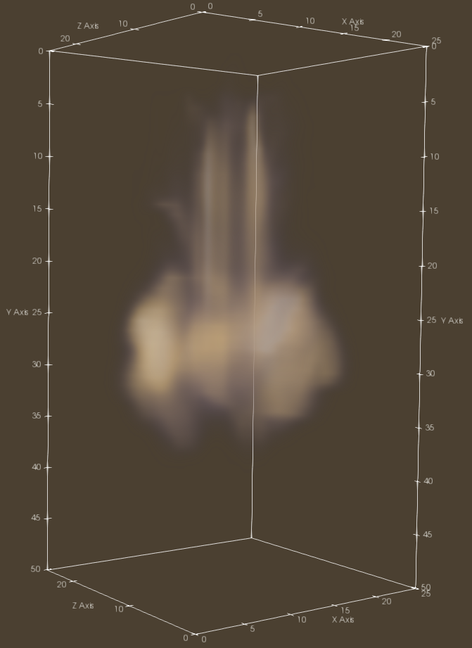

# Visual Simulation of Smoke
This is the implementation of *Visual Simulation of Smoke* by Ronald Fedkiw, Jos Stam, and Henrik Wann Jensen at SIGGRAPH 2001.

## Build
**Windows is not supported.**

Libraries you need are 
- Eigen 3.3.4
- GLM
- GLEW
- GLFW
- OpenCV (3.1.0)

You can build and execute following command.

```shell
$ git clone https://github.com/daichi-ishida/Visual-Simulation-of-Smoke.git
$ make run
```

When you run this program, simulation result is written to the "output" directory as AVI video format.

To get higher resolution, modify RESOLUTION in include/constants.hpp. Instead, the calculation gets much slower.
(most of the time is spent on solving poisson equation)

Screenshot: RESOLUTION = 3

## Screenshot

